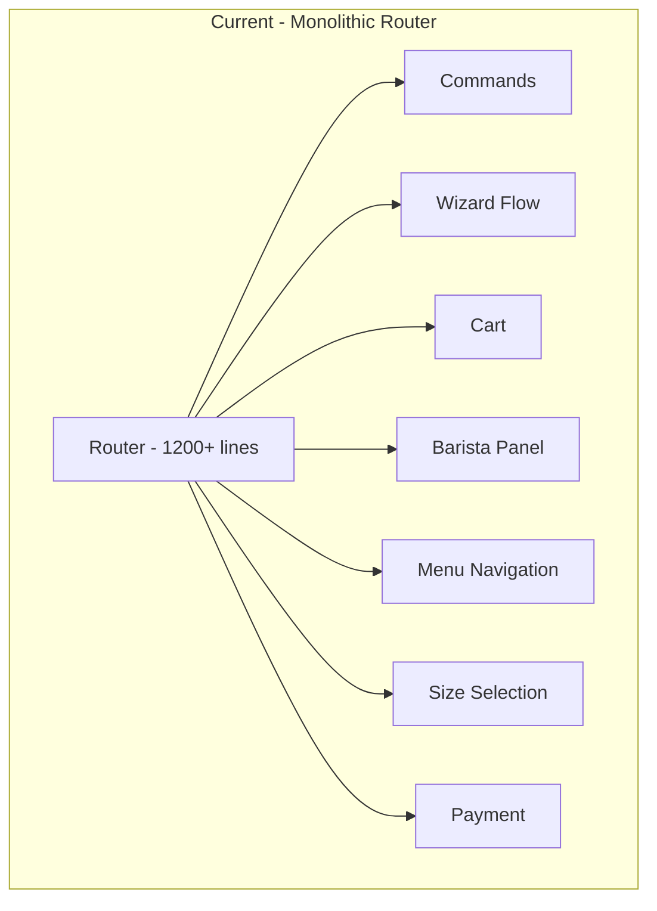
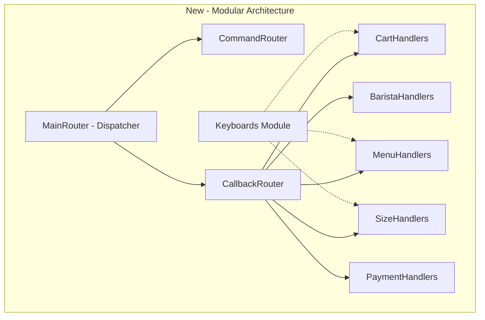

# Code Review & Refactoring Analysis

**Date:** 2026-03-10_00-36  
**Reviewer:** Kilo Code (Architect Mode)  
**Scope:** Uncommitted changes on branch `main`

---

## Executive Summary

**Risk Level:** MEDIUM

The changes introduce a well-designed drink sizes feature with proper test coverage. However, there are **runtime-breaking bugs** in Draft model access patterns and method arity mismatches that must be fixed before merging. Additionally, the Router class has grown to 1200+ lines and violates Single Responsibility Principle, warranting architectural refactoring.

---

## Technical Debt

### Critical (Must Fix Before Merge)

| Issue | File | Line | Description |
|-------|------|------|-------------|
| BUG | lib/bot/router.rb | 952 | `draft['step']` should be `draft.state['step']` or `draft.current_step` |
| BUG | lib/bot/router.rb | 994, 1026 | `draft['selected_addons']` should be `draft.state['selected_addons']` |
| BUG | lib/bot/router.rb | 1136 | `handle_qty_select` expects 3 args, called with 2 - will raise ArgumentError |

### Recommendations

| Issue | File | Description |
|-------|------|-------------|
| SRP Violation | lib/bot/router.rb | Router class is 1200+ lines with too many responsibilities |
| Performance | db/migrations/006 | Index removal on `invoice_id_provider` may impact payment lookups |

---

## Refactoring Strategy

### Phase 1: Fix Critical Bugs

These bugs will cause runtime errors and must be fixed immediately:

```ruby
# BEFORE (broken)
if draft && draft['step']
selected_addons = draft['selected_addons'] || []
handle_qty_select(callback, item_id)  # Missing qty argument

# AFTER (fixed)
if draft && draft.current_step
selected_addons = draft.state['selected_addons'] || []
handle_item_select(callback, item_id)  # Redirect to item selection
```

### Phase 2: Router Architecture Refactoring

The current Router class handles too many concerns:



**Proposed Modular Architecture:**



### Proposed File Structure

```
lib/bot/
├── router.rb                 # Main dispatcher (~100 lines)
├── keyboards.rb              # Existing - centralized keyboards
├── routers/
│   ├── base_router.rb        # Shared functionality
│   ├── command_router.rb     # /start, /menu, /order, /help, etc.
│   ├── callback_router.rb    # Callback dispatch logic
│   └── handlers/
│       ├── cart_handler.rb   # Cart actions: add, clear, checkout
│       ├── barista_handler.rb # Barista panel: queue, claim, complete
│       ├── menu_handler.rb   # Menu navigation: categories, items
│       ├── size_handler.rb   # Size selection flow
│       ├── order_handler.rb  # Order creation, confirmation
│       └── payment_handler.rb # Payment status checks
└── concerns/
    └── draft_access.rb       # Proper Draft state access patterns
```

### Handler Module Design

#### 1. BaseRouter (Shared Functionality)

```ruby
# lib/bot/routers/base_router.rb
module CoffeeBot
  module Bot
    module Routers
      module BaseRouter
        attr_reader :bot, :notifier
        
        def initialize(bot)
          @bot = bot
          @notifier = Services::Notifier.new(bot)
        end
        
        private
        
        def log_info(message, **params)
          CoffeeBot::Config.logger.info("[#{self.class.name}] #{message} #{params}")
        end
        
        def log_error(message, **params)
          CoffeeBot::Config.logger.error("[#{self.class.name}] #{message} #{params}")
        end
        
        # Proper Draft state access
        def draft_state(draft, key)
          return nil unless draft
          draft.state[key.to_s]
        end
        
        def draft_step(draft)
          draft&.current_step
        end
      end
    end
  end
end
```

#### 2. CommandRouter (Text Commands)

```ruby
# lib/bot/routers/command_router.rb
module CoffeeBot
  module Bot
    module Routers
      class CommandRouter
        include BaseRouter
        
        COMMANDS = {
          '/start' => :handle_start,
          '/menu' => :handle_menu,
          '/order' => :handle_order_start,
          '/my_orders' => :handle_my_orders,
          '/barista' => :handle_barista_panel,
          '/cancel' => :handle_cancel,
          '/help' => :handle_help
        }.freeze
        
        def dispatch(message)
          text = message.text.to_s.strip
          handler = COMMANDS[text] || COMMANDS[text.split.first]
          
          if handler
            send(handler, message)
          else
            handle_wizard_input(message)
          end
        end
        
        # Command handlers here...
      end
    end
  end
end
```

#### 3. Callback Router with Handler Modules

```ruby
# lib/bot/routers/callback_router.rb
module CoffeeBot
  module Bot
    module Routers
      class CallbackRouter
        include BaseRouter
        
        # Include handler modules
        include Handlers::CartHandler
        include Handlers::BaristaHandler
        include Handlers::MenuHandler
        include Handlers::SizeHandler
        include Handlers::OrderHandler
        include Handlers::PaymentHandler
        
        PATTERNS = [
          [%r{^category_(.+)$}, :handle_category_select],
          [%r{^item_(\d+)$}, :handle_item_select],
          [%r{^qty_(\d+)_(\d+)$}, :handle_qty_select],
          [%r{^cart_(add|checkout|clear|back)$}, :handle_cart_action],
          [%r{^size_(\d+)_(small|medium|large)$}, :handle_size_select],
          [%r{^qty_(\d+)_(small|medium|large)_(\d+)$}, :handle_qty_with_size],
          # ... more patterns
        ].freeze
        
        def dispatch(callback)
          bot.api.answer_callback_query(callback_query_id: callback.id)
          
          data = callback.data
          PATTERNS.each do |pattern, handler|
            if match = data.match(pattern)
              return send(handler, callback, *match.captures)
            end
          end
          
          log_info('Unknown callback', data: data)
        end
      end
    end
  end
end
```

#### 4. Draft Access Concern (Bug Prevention)

```ruby
# lib/bot/concerns/draft_access.rb
module CoffeeBot
  module Bot
    module Concerns
      module DraftAccess
        # Safe access to draft state values
        def draft_get(draft, key)
          return nil unless draft
          draft.state[key.to_s]
        end
        
        def draft_step(draft)
          draft&.current_step
        end
        
        def draft_items(draft)
          draft&.items || []
        end
        
        def draft_selected_addons(draft)
          draft_get(draft, 'selected_addons') || []
        end
        
        # Throws clear error if misused
        def raise_draft_access_error!(wrong_usage)
          raise ArgumentError, "Use draft.state['key'] not draft['key']. See DraftAccess concern."
        end
      end
    end
  end
end
```

---

## Architectural Impact

### Benefits of Refactoring

1. **Maintainability**: Each handler has a single responsibility (~100-150 lines)
2. **Testability**: Handler modules can be tested in isolation
3. **Extensibility**: New features can be added as new handler modules
4. **Debugging**: Easier to trace issues to specific handlers
5. **Team Collaboration**: Multiple developers can work on different handlers

### Migration Path

1. **Step 1**: Fix critical bugs in current Router
2. **Step 2**: Create `lib/bot/routers/` directory structure
3. **Step 3**: Extract BaseRouter with shared functionality
4. **Step 4**: Extract handlers one by one (start with smallest)
5. **Step 5**: Create new main Router as dispatcher
6. **Step 6**: Update tests for new structure
7. **Step 7**: Remove old monolithic Router

### Pattern Matching Opportunity

Ruby 2.7+ pattern matching can simplify callback dispatch:

```ruby
# Future enhancement with Ruby 2.7+ pattern matching
case callback.data
in 'cart_checkout'
  handle_checkout(callback)
in /^size_(\d+)_(small|medium|large)$/ => { id: item_id, size: }
  handle_size_select(callback, item_id, size)
in /^qty_(\d+)_(\d+)$/ => { id: item_id, qty: }
  handle_qty_select(callback, item_id, qty)
else
  log_info('Unknown callback', data: callback.data)
end
```

---

## Implementation Checklist

### Immediate (Before Merge)
- [ ] Fix `draft['step']` → `draft.current_step` at line 952
- [ ] Fix `draft['selected_addons']` → `draft.state['selected_addons']` at lines 994, 1026
- [ ] Fix `handle_qty_select` arity mismatch at line 1136
- [ ] Run full test suite to verify fixes

### Short-term (Next Sprint)
- [ ] Create `lib/bot/routers/` directory structure
- [ ] Extract `BaseRouter` module
- [ ] Extract `CartHandler` module
- [ ] Extract `BaristaHandler` module
- [ ] Update main Router to use new modules

### Medium-term (Future)
- [ ] Complete handler extraction for all modules
- [ ] Add unit tests for each handler module
- [ ] Consider Ruby 2.7+ pattern matching for dispatch
- [ ] Document handler module conventions

---

## Conclusion

The drink sizes feature implementation is solid, but critical bugs must be fixed before merging. The Router refactoring is a medium-priority technical debt item that will improve code maintainability as the bot grows in complexity.

**Recommendation:** Fix critical bugs immediately, then schedule Router refactoring for the next sprint.
