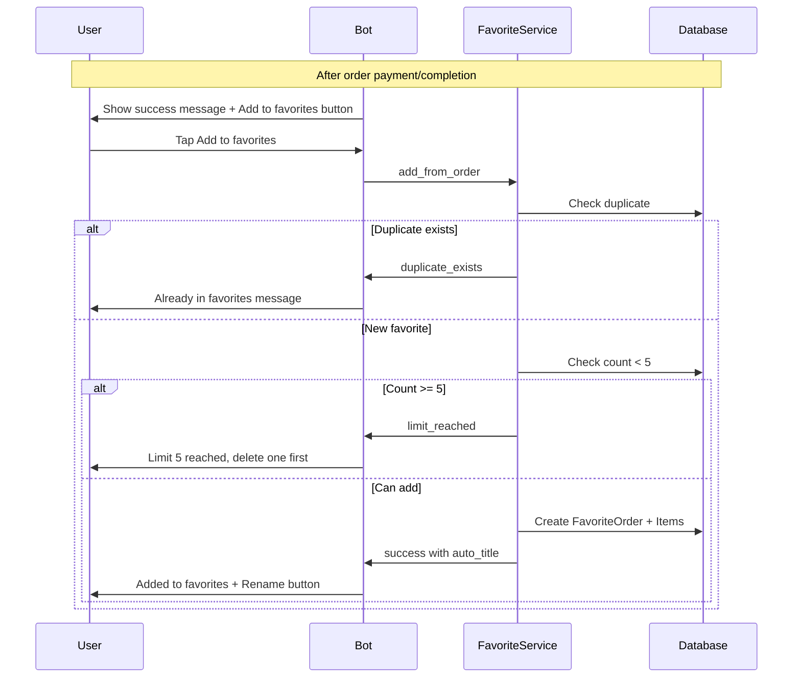
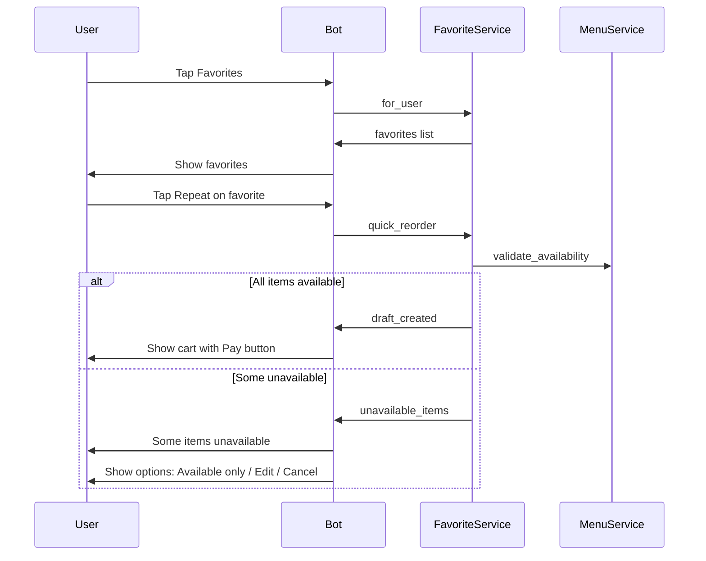

# Coffee Bot Feature Enhancements Plan

## Overview

This document outlines the implementation plan for multiple feature enhancements to the Coffee Bot, including:
1. Pre-order button when active order exists
2. Fix /cancel to cancel active orders
3. Invoice lifetime configuration (15 minutes)
4. Payment integration improvements (statusPayment, InvoiceCancel, callback handling, getHistoryCSV)
5. Favorite orders feature (complete implementation)

---

## Task 1: Pre-order Button for Active Orders

### Current Behavior
In [`lib/bot/router.rb:171-187`](lib/bot/router.rb:171), when a user has an active order and tries to create a new order:

```ruby
def handle_order_start(message)
  user_id = message.from.id
  active = Services::OrderService.active_order_for_client(user_id)
  if active
    bot.api.send_message(
      chat_id: user_id,
      text: "У вас уже есть активный заказ ##{active.id}. Дождитесь его завершения."
    )
    return
  end
  # ...
end
```

### Required Changes

#### 1.1 Modify `handle_order_start` in Router
- Instead of just showing text, show an inline button "Сделать предзаказ"
- Include order info: order number and item names with quantities

#### 1.2 Implementation Steps
1. Create helper method `format_active_order_summary(order)` that returns order items summary
2. Modify `handle_order_start` to show button when active order exists
3. Add callback handler `preorder_start` that initiates the order flow

#### 1.3 Files to Modify
- [`lib/bot/router.rb`](lib/bot/router.rb) - Add new callback handler and modify `handle_order_start`
- [`lib/bot/keyboards.rb`](lib/bot/keyboards.rb) - Add `preorder_keyboard` method

---

## Task 2: Fix /cancel to Cancel Active Orders

### Current Behavior
In [`lib/bot/router.rb:222-232`](lib/bot/router.rb:222):

```ruby
def handle_cancel(message)
  user_id = message.from.id
  Draft.clear(user_id)  # Only clears draft, not active orders!
  bot.api.send_message(
    chat_id: user_id,
    text: '❌ Заказ отменён. Начните заново с /order'
  )
end
```

### Required Changes

#### 2.1 Modify `handle_cancel` in Router
- Check for active orders (INVOICE_CREATED status)
- Call `InvoiceCancel` API if invoice exists
- Cancel the order locally
- Then clear the draft

#### 2.2 Add `cancel_invoice` method to MWallet Client
In [`lib/services/mwallet/mwallet_client.rb`](lib/services/mwallet/mwallet_client.rb):

```ruby
def cancel_invoice(invoice_id)
  request_params = {
    'cmd' => 'InvoiceCancel',
    'version' => @version,
    'sid' => @sid,
    'mktime' => Time.now.to_i.to_s,
    'lang' => 'ru',
    'data' => { 'invoice_id' => invoice_id }
  }
  # ... implementation
end
```

#### 2.3 Implementation Steps
1. Add `cancel_invoice` method to `MWallet::Client`
2. Add `cancel_invoice` method to `MWallet::Service` (wraps client call)
3. Modify `OrderService.cancel_order` to call MWallet cancel
4. Update `handle_cancel` in router to cancel active orders

#### 2.4 Files to Modify
- [`lib/services/mwallet/mwallet_client.rb`](lib/services/mwallet/mwallet_client.rb) - Add `cancel_invoice` method
- [`lib/services/mwallet/mwallet_service.rb`](lib/services/mwallet/mwallet_service.rb) - Add `cancel_invoice` wrapper
- [`lib/services/order_service.rb`](lib/services/order_service.rb) - Update `cancel_order` method
- [`lib/bot/router.rb`](lib/bot/router.rb) - Update `handle_cancel` method

---

## Task 3: Invoice Lifetime Configuration (15 minutes)

### Current Behavior
In [`lib/services/mwallet/mwallet_service.rb:41`](lib/services/mwallet/mwallet_service.rb:41):

```ruby
date_life: CoffeeBot::Config::ORDER_EXPIRE_MINUTES * 60
```

The configuration already exists in [`config/boot.rb:53`](config/boot.rb:53):
```ruby
ORDER_EXPIRE_MINUTES = ENV.fetch('ORDER_EXPIRE_MINUTES', 15).to_i
```

### Required Changes

#### 3.1 Verify Configuration
- Ensure `date_life` is correctly set to 900 seconds (15 * 60)
- The current implementation appears correct

#### 3.2 Implementation Steps
1. Verify `ORDER_EXPIRE_MINUTES` is used correctly
2. Add logging to confirm invoice lifetime is set properly
3. Ensure `expires_at` is set on order when invoice is created

#### 3.3 Files to Verify/Modify
- [`lib/services/mwallet/mwallet_service.rb`](lib/services/mwallet/mwallet_service.rb) - Verify `date_life` calculation
- [`lib/models/order.rb`](lib/models/order.rb) - Ensure `set_invoice_data` sets `expires_at`

---

## Task 4: Payment Integration Improvements

### 4.1 statusPayment - Poll Payment Status

#### Current Implementation
The `get_status` method exists in [`lib/services/mwallet/mwallet_client.rb:40-57`](lib/services/mwallet/mwallet_client.rb:40).

#### Required Changes
- Poll every 2 seconds after invoice creation
- Only notify barista after payment confirmation

#### Implementation Steps
1. Create `PaymentPoller` job class that polls every 2 seconds
2. Start poller after invoice is created
3. On successful payment:
   - Update order status to PAID
   - Notify baristas
   - Stop polling
4. On expiry (15 min), stop polling

#### Files to Create/Modify
- Create `lib/jobs/payment_poller.rb`
- Modify [`lib/bot/router.rb`](lib/bot/router.rb) - Start poller after invoice creation
- Modify [`lib/services/notifier.rb`](lib/services/notifier.rb) - Barista notification logic

### 4.2 InvoiceCancel Implementation

Covered in Task 2.2 above.

### 4.3 Callback Handling (result_url)

#### Current Implementation
In [`lib/services/mwallet/mwallet_service.rb:119-177`](lib/services/mwallet/mwallet_service.rb:119), `process_callback` exists.

#### Required Changes
- Ensure callback properly marks order as PAID
- Notify baristas via Notifier service

#### Implementation Steps
1. Verify callback processing marks order as PAID
2. Add barista notification in callback processing
3. Ensure callback_app properly routes to service

#### Files to Modify
- [`lib/services/mwallet/mwallet_service.rb`](lib/services/mwallet/mwallet_service.rb) - Add barista notification
- [`lib/http/callback_app.rb`](lib/http/callback_app.rb) - Verify routing

### 4.4 getHistoryCSV - Order Reports

#### Required Implementation
New API method to get order history in CSV format.

#### Implementation Steps
1. Add `get_history_csv` method to `MWallet::Client`
2. Create `ReportService` to generate CSV reports
3. Add `/report` command for baristas
4. Generate CSV with order details

#### Files to Create/Modify
- [`lib/services/mwallet/mwallet_client.rb`](lib/services/mwallet/mwallet_client.rb) - Add `get_history_csv`
- Create `lib/services/report_service.rb`
- [`lib/bot/router.rb`](lib/bot/router.rb) - Add `/report` command handler

---

## Task 5-14: Favorite Orders Feature

### Database Schema

#### Migration: Create favorite_orders table
```ruby
# db/migrations/012_create_favorite_orders.rb
create_table :favorite_orders do
  primary_key :id
  Bignum :telegram_user_id, null: false
  String :title, null: false
  DateTime :created_at, null: false
  DateTime :updated_at
  DateTime :last_used_at
  index [:telegram_user_id]
end
```

#### Migration: Create favorite_order_items table
```ruby
# db/migrations/013_create_favorite_order_items.rb
create_table :favorite_order_items do
  primary_key :id
  foreign_key :favorite_order_id, :favorite_orders, on_delete: :cascade
  foreign_key :menu_item_id, :menu_items
  String :item_name_snapshot, null: false
  Integer :qty, null: false
  String :size  # small, medium, large, or null
  Integer :unit_price_snapshot  # In tyiyn (cents)
  String :addons_json  # JSON array of addons
  String :comment
end
```

### Model Implementation

#### FavoriteOrder Model
```ruby
# lib/models/favorite_order.rb
class FavoriteOrder < Sequel::Model
  one_to_many :favorite_order_items
  
  # Validations
  def validate
    super
    errors.add(:telegram_user_id, 'cannot be nil') if telegram_user_id.nil?
    errors.add(:title, 'cannot be empty') if title.nil? || title.empty?
  end
  
  # Scopes
  dataset_module do
    def for_user(telegram_user_id)
      where(telegram_user_id: telegram_user_id).order(Sequel.desc(:last_used_at))
    end
    
    def recent(limit = 5)
      order(Sequel.desc(:last_used_at)).limit(limit)
    end
  end
  
  # Class methods
  def self.count_for_user(telegram_user_id)
    for_user(telegram_user_id).count
  end
  
  def self.can_add_more?(telegram_user_id)
    count_for_user(telegram_user_id) < 5
  end
  
  # Check if duplicate exists
  def self.duplicate_exists?(telegram_user_id, items_signature)
    # Compare items signature to detect duplicates
  end
  
  # Generate auto title
  def self.generate_auto_title(items)
    # "Капучино L + ваниль" format
  end
  
  # Instance methods
  def create_draft_for_user!
    # Create draft from favorite items
  end
  
  def validate_items_availability!
    # Check if all items still exist in menu
  end
  
  def format_for_display
    # Format for Telegram message
  end
end
```

#### FavoriteOrderItem Model
```ruby
# lib/models/favorite_order_item.rb
class FavoriteOrderItem < Sequel::Model
  many_to_one :favorite_order
  many_to_one :menu_item
  
  def addons
    return [] if addons_json.nil?
    JSON.parse(addons_json)
  end
  
  def addons=(addon_list)
    self.addons_json = addon_list.to_json
  end
end
```

### Service Layer

#### FavoriteService
```ruby
# lib/services/favorite_service.rb
module CoffeeBot
  module Services
    class FavoriteService
      # Add order to favorites
      def self.add_from_order(order, title: nil)
        # Create favorite from order
      end
      
      # Get user favorites
      def self.for_user(telegram_user_id)
        FavoriteOrder.for_user(telegram_user_id).all
      end
      
      # Quick reorder
      def self.quick_reorder(favorite_order, telegram_user_id)
        # Validate items
        # Create draft
        # Update last_used_at
      end
      
      # Rename favorite
      def self.rename(favorite_id, new_title)
        # Update title
      end
      
      # Delete favorite
      def self.delete(favorite_id)
        # Destroy record
      end
      
      # Check for duplicates
      def self.duplicate?(telegram_user_id, items)
        # Compare with existing favorites
      end
      
      # Validate menu availability
      def self.validate_availability(favorite_order)
        # Return list of unavailable items
      end
    end
  end
end
```

### Router Callbacks

#### New Callback Handlers
```ruby
# In lib/bot/router.rb

# Callback patterns:
# favorite_list - Show favorites list
# favorite_add - Add current order to favorites
# favorite_reorder_<id> - Quick reorder from favorite
# favorite_edit_<id> - Edit favorite (creates draft)
# favorite_rename_<id> - Rename favorite
# favorite_delete_<id> - Delete favorite
# favorite_confirm_delete_<id> - Confirm deletion
```

#### Implementation Steps
1. Add `⭐ Избранное` button to main menu keyboard
2. Add callback handlers for all favorite actions
3. Add "Добавить в избранное" button after order completion
4. Implement rename flow (text input wizard)
5. Implement delete confirmation

### Keyboard Updates

#### Main Menu Update
```ruby
# In lib/bot/keyboards.rb
def self.main_menu
  Telegram::Bot::Types::InlineKeyboardMarkup.new(
    inline_keyboard: [
      # ... existing buttons ...
      [
        Telegram::Bot::Types::InlineKeyboardButton.new(
          text: '⭐ Избранное',
          callback_data: 'favorite_list'
        )
      ]
    ]
  )
end
```

#### Favorites List Keyboard
```ruby
def self.favorites_keyboard(favorites)
  # List favorites with action buttons
end

def self.favorite_actions_keyboard(favorite_id)
  # Repeat, Edit, Rename, Delete buttons
end
```

### User Flow Diagrams

#### Adding to Favorites


#### Quick Reorder Flow


### Implementation Checklist

#### Phase 1: Database & Models
- [ ] Create migration `012_create_favorite_orders.rb`
- [ ] Create migration `013_create_favorite_order_items.rb`
- [ ] Create `lib/models/favorite_order.rb`
- [ ] Create `lib/models/favorite_order_item.rb`
- [ ] Run migrations

#### Phase 2: Service Layer
- [ ] Create `lib/services/favorite_service.rb`
- [ ] Implement `add_from_order`
- [ ] Implement `for_user`
- [ ] Implement `quick_reorder`
- [ ] Implement `rename`
- [ ] Implement `delete`
- [ ] Implement `duplicate?`
- [ ] Implement `validate_availability`

#### Phase 3: UI Integration
- [ ] Update main menu keyboard with Favorites button
- [ ] Add `favorite_list` callback handler
- [ ] Add `favorite_add` callback handler
- [ ] Add `favorite_reorder_<id>` callback handler
- [ ] Add `favorite_edit_<id>` callback handler
- [ ] Add `favorite_rename_<id>` callback handler
- [ ] Add `favorite_delete_<id>` callback handler
- [ ] Add rename wizard (text input handling)
- [ ] Add delete confirmation dialog

#### Phase 4: Post-Order Integration
- [ ] Add "Add to favorites" button after order completion
- [ ] Handle auto-title generation
- [ ] Handle rename option after adding

#### Phase 5: Keyboards
- [ ] Add `favorites_keyboard` to keyboards.rb
- [ ] Add `favorite_actions_keyboard` to keyboards.rb
- [ ] Add `favorite_confirm_delete_keyboard` to keyboards.rb

---

## Summary of All Files to Create/Modify

### New Files to Create
1. `db/migrations/012_create_favorite_orders.rb`
2. `db/migrations/013_create_favorite_order_items.rb`
3. `lib/models/favorite_order.rb`
4. `lib/models/favorite_order_item.rb`
5. `lib/services/favorite_service.rb`
6. `lib/jobs/payment_poller.rb`
7. `lib/services/report_service.rb`

### Files to Modify
1. [`lib/bot/router.rb`](lib/bot/router.rb) - Multiple callback handlers
2. [`lib/bot/keyboards.rb`](lib/bot/keyboards.rb) - New keyboards
3. [`lib/services/mwallet/mwallet_client.rb`](lib/services/mwallet/mwallet_client.rb) - cancel_invoice, get_history_csv
4. [`lib/services/mwallet/mwallet_service.rb`](lib/services/mwallet/mwallet_service.rb) - cancel wrapper, barista notification
5. [`lib/services/order_service.rb`](lib/services/order_service.rb) - Enhanced cancel_order
6. [`lib/services/notifier.rb`](lib/services/notifier.rb) - Barista notification on payment
7. [`lib/http/callback_app.rb`](lib/http/callback_app.rb) - Verify callback routing

---

## Recommended Implementation Order

1. **Task 2**: Fix /cancel (foundational for proper order management)
2. **Task 3**: Verify invoice lifetime (quick verification)
3. **Task 1**: Pre-order button (improves UX for active orders)
4. **Task 4.1-4.3**: Payment polling and callback improvements
5. **Task 4.4**: getHistoryCSV reports
6. **Task 5-14**: Favorite orders feature (largest feature set)
