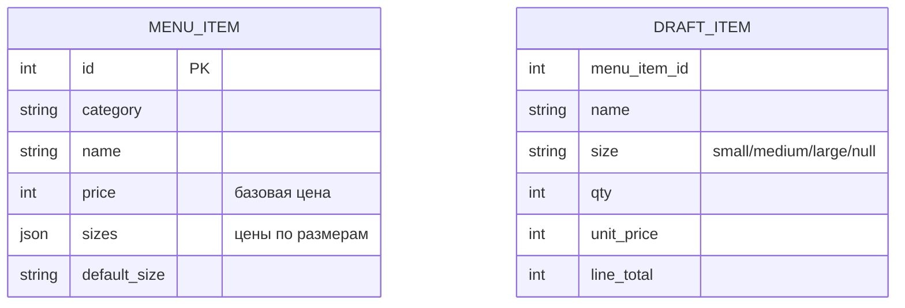
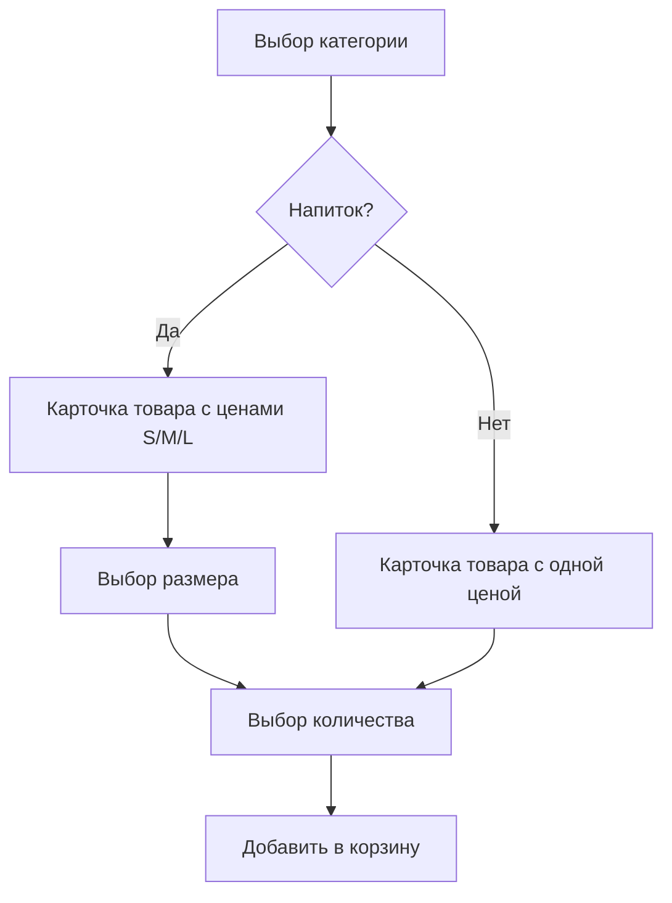

# План: Размеры напитков и выбор количества

**Дата:** 2026-03-09
**Статус:** Планирование

## Требования

1. **Размеры только для напитков** (Кофе, Чай)
2. **Полные цены** для каждого размера (S=130, M=150, L=190 сом)
3. **Без размеров** - только выбор количества (десерты, добавки)

## Архитектура данных

### 1. Миграция: Добавить поле `sizes` в `menu_items`

```ruby
# db/migrations/011_add_sizes_to_menu_items.rb
Sequel.migration do
  up do
    # JSON-поле с ценами по размерам
    # null = товар без размеров (десерты, добавки)
    # {"small" => 13000, "medium" => 15000, "large" => 18000}
    add_column :menu_items, :sizes, :json
    
    # Размер по умолчанию (для обратной совместимости)
    add_column :menu_items, :default_size, String, default: 'medium'
  end
  
  down do
    drop_column :menu_items, :sizes
    drop_column :menu_items, :default_size
  end
end
```

### 2. Структура данных



### 3. Обновление модели MenuItem

```ruby
# lib/models/menu_item.rb

# Проверка наличия размеров
def has_sizes?
  sizes && !sizes.empty?
end

# Цена для конкретного размера
def price_for_size(size)
  return price unless has_sizes?
  sizes[size] || sizes[default_size] || price
end

# Форматированный вывод цен
def formatted_prices
  return formatted_price unless has_sizes?
  
  sizes.map do |size, price_kgs|
    size_label = {'small' => 'S', 'medium' => 'M', 'large' => 'L'}[size]
    "#{size_label} #{price_kgs / 100} сом"
  end.join(' | ')
end

# Категории с размерами
DRINK_CATEGORIES = ['Кофе', 'Чай'].freeze

def self.drinks_with_sizes
  where(category: DRINK_CATEGORIES).where(Sequel.~(sizes: nil))
end
```

### 4. Обновление Draft

```ruby
# Структура item в Draft.state['items']
{
  'menu_item_id' => 123,
  'name' => 'Капучино',
  'size' => 'medium',  # NEW: размер или nil
  'qty' => 2,
  'unit_price' => 15000,
  'line_total' => 30000
}

# Новый метод добавления с размером
def add_item_with_size(menu_item, size, quantity)
  items = self.items
  unit_price = menu_item.price_for_size(size)
  
  # Найти существующий элемент с таким же размером
  existing = items.find do |i| 
    i['menu_item_id'] == menu_item.id && i['size'] == size
  end
  
  if existing
    existing['qty'] += quantity
    existing['line_total'] = existing['qty'] * existing['unit_price']
  else
    items << {
      'menu_item_id' => menu_item.id,
      'name' => menu_item.name,
      'size' => size,
      'qty' => quantity,
      'unit_price' => unit_price,
      'line_total' => unit_price * quantity
    }
  end
  
  update_state('items' => items)
end
```

## UX Flow



## Клавиатуры

### 1. Карточка напитка с размерами

```
┌─────────────────────────────────┐
│ ☕ Капучино                      │
│                                 │
│ S 130 сом | M 150 сом | L 190 сом│
│                                 │
│ ┌───────┐ ┌───────┐ ┌───────┐   │
│ │ S 130 │ │ M 150 │ │ L 190 │   │
│ └───────┘ └───────┘ └───────┘   │
│                                 │
│ ┌─────────────────────────────┐ │
│ │ ➕ Добавки                  │ │
│ └─────────────────────────────┘ │
│ ┌─────────────────────────────┐ │
│ │ 🔙 Назад                    │ │
│ └─────────────────────────────┘ │
└─────────────────────────────────┘
```

### 2. Выбор количества

```
┌─────────────────────────────────┐
│ 🔢 Выберите количество:         │
│                                 │
│ ┌───┐ ┌───┐ ┌───┐ ┌───┐ ┌───┐  │
│ │ 1 │ │ 2 │ │ 3 │ │ 4 │ │ 5 │  │
│ └───┘ └───┘ └───┘ └───┘ └───┘  │
└─────────────────────────────────┘
```

### 3. Карточка десерта (без размеров)

```
┌─────────────────────────────────┐
│ 🍰 Чизкейк                      │
│                                 │
│ 180 сом                         │
│                                 │
│ ┌─────────────────────────────┐ │
│ │ ➕ Добавить в корзину       │ │
│ └─────────────────────────────┘ │
│ ┌─────────────────────────────┐ │
│ │ 🔙 Назад                    │ │
│ └─────────────────────────────┘ │
└─────────────────────────────────┘
```

## Обработчики в Router

### Новые callback patterns

| Pattern | Описание |
|---------|----------|
| `select_size_{item_id}_{size}` | Выбор размера |
| `select_qty_{item_id}_{size}` | Выбор количества для размера |

### Обновлённый flow

```ruby
# 1. Пользователь нажимает на товар
def handle_item_select(callback, item_id)
  item = MenuItem[item_id]
  
  if item.has_sizes?
    # Показать клавиатуру выбора размера
    keyboard = Bot.size_keyboard(item)
    # ...
  else
    # Сразу показать выбор количества
    keyboard = Bot.quantity_keyboard(item_id, nil)
    # ...
  end
end

# 2. Выбор размера
def handle_size_select(callback, item_id, size)
  # Сохранить выбранный размер в draft state
  Draft.update_state(user_id, 'current_size' => size, 'current_item_id' => item_id)
  
  # Показать выбор количества
  keyboard = Bot.quantity_keyboard(item_id, size)
  # ...
end

# 3. Выбор количества
def handle_qty_select(callback, item_id, qty, size = nil)
  size ||= Draft.for_user(user_id)['current_size']
  
  item = MenuItem[item_id]
  draft = Draft.get_or_create(user_id)
  draft.add_item_with_size(item, size, qty)
  
  # Показать корзину или upsell
  # ...
end
```

## Файлы для изменения

| Файл | Изменения |
|------|-----------|
| `db/migrations/011_add_sizes_to_menu_items.rb` | **Новый** - миграция |
| `lib/models/menu_item.rb` | Методы `has_sizes?`, `price_for_size`, `formatted_prices` |
| `lib/models/draft.rb` | Метод `add_item_with_size`, обновить `format_cart` |
| `lib/bot/keyboards.rb` | `size_keyboard`, обновить `item_keyboard` |
| `lib/bot/router.rb` | Обработчики `handle_size_select`, обновить `handle_qty_select` |
| `lib/services/menu_service.rb` | Обновить `seed_menu` с размерами |
| `spec/` | Тесты для новой функциональности |

## Пример данных для seed

```ruby
{
  category: 'Кофе',
  name: 'Капучино',
  price: 15000,  # Базовая цена (medium) для обратной совместимости
  sizes: {
    'small' => 13000,
    'medium' => 15000,
    'large' => 18000
  },
  default_size: 'medium'
}

{
  category: 'Десерты',
  name: 'Чизкейк',
  price: 18000,
  sizes: nil,  # Без размеров
  default_size: nil
}
```
